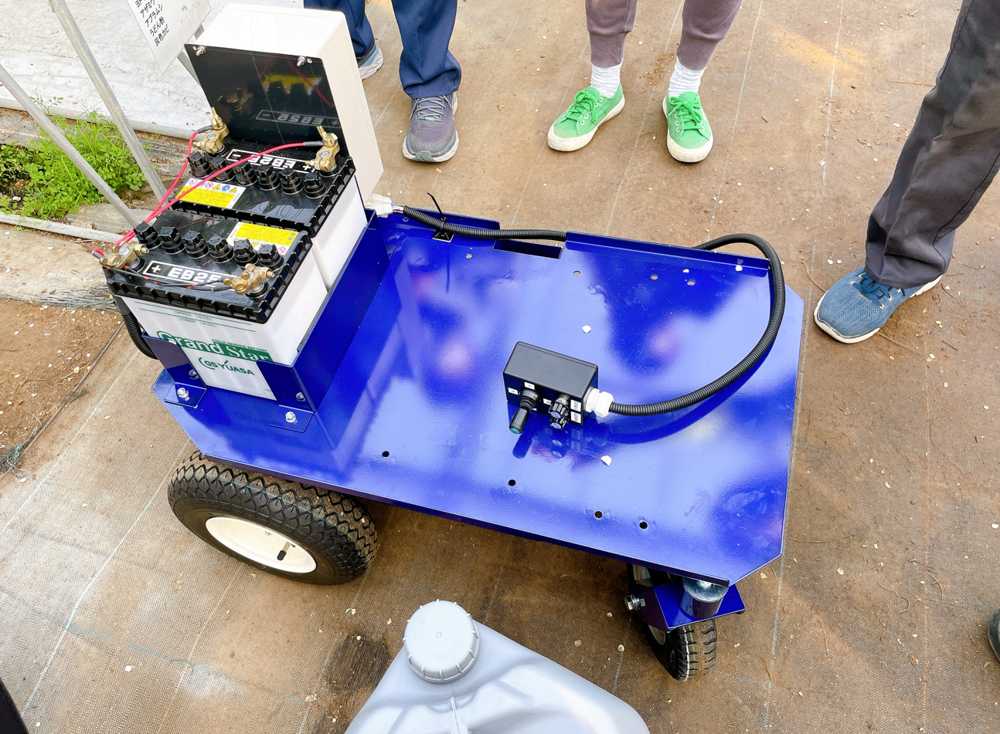
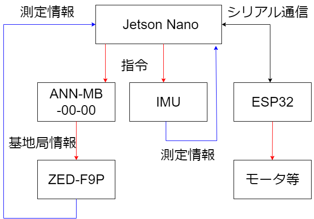
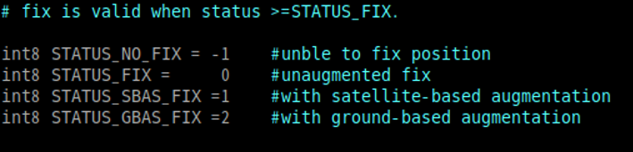
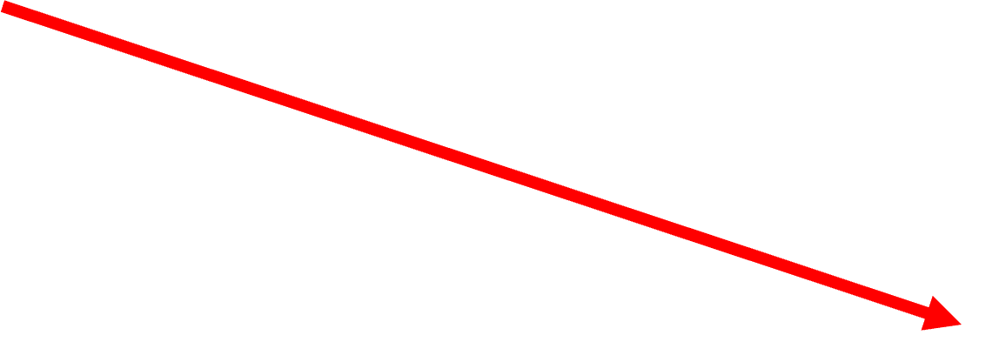

# RTK-GNSSを用いた自律移動ロボットの開発

本リポジトリは，香川高専時代に取り組んだ卒業研究の概要をまとめたものです．

個人情報，印影，所属先情報，未整理の研究資料を含む可能性があるため，卒業研究論文のPDFや詳細資料は公開していません．  
研究内容の概要を確認できるよう，READMEに要点のみを整理しています．

## 概要

本研究では，農場内での自律走行を目的として，RTK-GNSSを用いた自律移動ロボットの開発に取り組みました．

  
  

想定した用途は，イチゴ栽培環境における農薬散布ロボットです．農場内の狭い通路を走行するためには，通常のGPSで発生する数メートル単位の誤差では不十分であり，より高精度な自己位置推定が必要になります．

そこで，GPSより高精度な測位が可能なRTK-GNSSを利用し，屋外環境でロボットが自己位置を推定するためのシステム構築を行いました．

## 目的

本研究の目的は，RTK-GNSSを用いて高精度な位置情報を取得し，自律移動ロボットの自己位置推定に活用することです．

特に，以下を目標としました．

- RTK-GNSSによる高精度測位の確認
- ROSを用いたロボット制御システムの構築
- Jetson NanoとESP32を用いた制御構成の設計
- エンコーダ情報の取得
- センサ情報統合による自己位置推定の安定化検討

## 使用技術

主に以下の技術・機器を使用しました．

- RTK-GNSS
- ROS melodic
- Ubuntu 18.04 LTS
- Jetson Nano
- ESP32
- ZED-F9P
- GNSSアンテナ
- AS5048A 磁気エンコーダ
- SPI通信
- rosserial
- RTKLIB
- カルマンフィルタ
- 拡張カルマンフィルタ

## システム構成

システムは，Jetson Nanoを中心に構成しました．

  

- Jetson Nano  
  ROSを用いたメイン処理，RTK-GNSS情報の取得，ESP32との通信を担当．

- ESP32  
  モータ制御やエンコーダ情報の取得を担当．

- ZED-F9P  
  RTK-GNSSによる位置情報取得を担当．

- AS5048A  
  モータ回転に関する情報取得を担当．

Jetson NanoとESP32間では，rosserialを用いてROSメッセージをやり取りする構成としました．

## 取り組んだ内容

本研究では，以下の実装・検証を行いました．

- RTK-GNSSを用いた位置情報取得
- ROSトピックを用いた測位情報の確認
- Jetson NanoとESP32間の通信
- SPI通信によるエンコーダ値の取得
- エンコーダ値から角度情報への変換
- カルマンフィルタによるセンサ統合方法の検討
- 緯度経度情報をロボット制御に扱いやすい座標系へ変換する方法の整理

## 得られた結果

RTK-GNSSによる測位実験では，ROSトピック上で測位状態を確認し，Fix解が得られていることを確認しました．

  

また，取得した緯度・経度を地図上で確認したところ，アンテナを設置した位置とよく一致しており，屋外環境において高精度な位置情報を取得できることを確認しました．

  

さらに，RTK-GNSS単体ではなく，エンコーダやLiDARなどのセンサと組み合わせることで，自己位置推定の安定性を高められる可能性について整理しました．

## 学んだこと

この研究を通じて，以下を経験しました．

- ロボット制御システムの構成設計
- ROSを用いたセンサ情報の取得と通信
- 組み込み機器とメインコンピュータの連携
- RTK-GNSSを用いた高精度測位
- センサ情報の統合に関する基礎的な考え方
- 実機ロボットを扱う際のハードウェア・ソフトウェア両面の調整

## 今後の課題

今後の課題としては，以下が挙げられます．

- 実農場環境での走行実験
- RTK-GNSS，エンコーダ，LiDARの統合精度向上
- 経路追従制御の実装
- 障害物検知・回避機能の追加
- 長時間運用時の安定性評価

## Note

本リポジトリは，研究内容の概要を示すことを目的としています．  
個人情報や印影等を含む可能性があるため，卒業研究論文のPDF，詳細資料，実験データは公開していません．

## Author

Takato Maekawa
